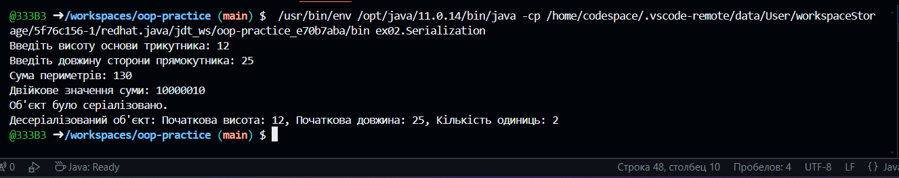

## Завдання 1
Написати просту консольну програму
```java
package ex01;
import java.util.Random;

public class something {
    private static final int TICKETS_COUNT = 100; 

    public static void Calculate() {
        Random random = new Random();
        int happyTicketsCount = 0;

        for (int i = 0; i < TICKETS_COUNT; i++) {
            int ticketNumber = 100000 + random.nextInt(900000); 
            if (isHappyTicket(ticketNumber)) {
                System.out.println("Щасливий квиток: " + ticketNumber);
                happyTicketsCount++;
            }
        }

        System.out.println("Кількість щасливих квитків: " + happyTicketsCount);
    }
    private static boolean isHappyTicket(int number) {
        int firstPart = number / 1000;
        int secondPart = number % 1000;

        return sumOfDigits(firstPart) == sumOfDigits(secondPart);
    }
    private static int sumOfDigits(int number) {
        int sum = 0;
        while (number > 0) {
            sum += number % 10;
            number /= 10;
        }
        return sum;
    }
    public static void main(String[] args) {
        something.Calculate();
    }
}
```
Результат роботи:

## Завдання 2 
Клас для серіалізації/десеріалізації та демонстрації в діалоговому режимі збереження та відновлення стану об'єкта.

```java
package ex02;
import java.io.*;
import java.util.Scanner;

        /**
        * Клас для демонстрації в діалоговому режимі збереження та відновлення стану об'єкта серіалізації/десеріалізації
        */
public class Serialization {
    public static void main(String[] args) {
        Scanner scanner = new Scanner(System.in);

        /**
        * @parambaseHeight - записує значення висоти
        */
        System.out.print("Введіть висоту основи трикутника: ");
        int baseHeight = scanner.nextInt();
       
       /**
        *@param rectangleLength - записує значення довжини
        */
        System.out.print("Введіть довжину сторони прямокутника: ");
        int rectangleLength = scanner.nextInt();
        /**
         * 
         * @param countOnes - викликає метод countOnesInBinary класу BinaryCountCalculator, 
         * передаючи йому параметри baseHeight і rectangleLength, і присвоює результат цього виклику змінній countOnes.
         */
        int countOnes = BinaryCountCalculator.countOnesInBinary(baseHeight, rectangleLength);
        scanner.close();
        /**
         * @param result - створює новий об'єкт класу CalculationResult, передаючи йому параметри
         * baseHeight, rectangleLength і countOnes, і присвоює цей об'єкт змінній result.
         */
        CalculationResult result = new CalculationResult(baseHeight, rectangleLength, countOnes);

        /**
        * Серіалізує об'єкт `result` із результатами обчислень у файл "calculation_result.ser".
        * Виводить повідомлення про успішну серіалізацію.
        * за допомогою об'єкта ObjectOutputStream. Це відбувається всередині блоку try-with-resources,
        * що автоматично закриває ObjectOutputStream після завершення виконання блоку.
        * @param result об'єкт, який необхідно серіалізувати
        */
        try (ObjectOutputStream out = new ObjectOutputStream(new FileOutputStream("calculation_result.ser"))) {
            out.writeObject(result);
            System.out.println("Об'єкт було серіалізовано.");
        } catch (IOException e) {
            e.printStackTrace();
        }

        /**
         * 54-59 виконується зчитування серіалізованого об'єкта з файлу "calculation_result.ser" за допомогою ObjectInputStream.
         * Це відбувається всередині блоку try-with-resources, що автоматично закриває ObjectInputStream після завершення виконання блоку.
         * після завершення виконання блоку. Якщо в процесі зчитування виникає помилка вони відловлюються в блоку catch
         */
        try (ObjectInputStream in = new ObjectInputStream(new FileInputStream("calculation_result.ser"))) {
            CalculationResult deserializedResult = (CalculationResult) in.readObject();
            System.out.println("Десеріалізований об'єкт: " + deserializedResult);
        } catch (IOException | ClassNotFoundException e) {
            e.printStackTrace();
        }

    }
}
```
клас для знаходження рішення задачі.
```java
package ex02;
    /**
     * @BinaryCountCalculator - відповідає за обчислення кількості одиниць у двійковому представленні суми значень.
    */
public class BinaryCountCalculator {
    /**
    * Метод обчислює кількість одиниць у двійковому представленні суми периметрів
    * рівнобедреного трикутника та прямокутника по заданій висоті та довжині сторони основи.
    * @param baseHeight        висота основи трикутника
    * @param rectangleLength   довжина сторони прямокутника
    * @return кількість одиниць у двійковому представленні суми периметрів
    */
    public static int countOnesInBinary(int baseHeight, int rectangleLength) {
        int perimeterTriangle = 2 * (baseHeight + (int) Math.sqrt(Math.pow(baseHeight, 2) + Math.pow(rectangleLength / 2, 2)));
        int perimeterRectangle = 2 * (rectangleLength + baseHeight);
        int sum = perimeterTriangle + perimeterRectangle;
        String binary = Integer.toBinaryString(sum);
        System.out.println("Сума периметрів: " + sum);
        System.out.println("Двійкове значення суми: " + binary);
        int countOnes = 0;
        for (char c : binary.toCharArray()) {
            if (c == '1') {
                countOnes++;
            }
        }
        return countOnes;
    }
}
```

Клас для збереження та відновлення стану об'єкта.

```java
package ex02;

import java.io.Serializable;

    /**
 * Клас, який представляє результати обчислень і є серіалізованим.
 * Зберігає параметри і результати обчислень, а саме висоту основи трикутника,
 * довжину сторони прямокутника та кількість одиниць у двійковому представленні суми периметрів.
 */
public class CalculationResult implements Serializable {
    private static final long serialVersionUID = 1L;
    private int baseHeight;
    private int rectangleLength;
    private int countOnes;

            /**
        * Конструктор класу CalculationResult для ініціалізації параметрів та результатів обчислень.
        *
        * @param baseHeight        висота основи трикутника
        * @param rectangleLength   довжина сторони прямокутника
        * @param countOnes         кількість одиниць у двійковому представленні суми периметрів
        */
    public CalculationResult(int baseHeight, int rectangleLength, int countOnes) {
        this.baseHeight = baseHeight;
        this.rectangleLength = rectangleLength;
        this.countOnes = countOnes;
    }

            /**
        * Повертає висоту основи трикутника.
        *
        * @return висота основи трикутника
        */
    public int getBaseHeight() {
        return baseHeight;
    }
            /**
        * Встановлює висоту основи трикутника.
        *
        * @param baseHeight нове значення висоти основи трикутника
        */
    public void setBaseHeight(int baseHeight) {
        this.baseHeight = baseHeight;
    }
            /**
        * Повертає довжину сторони прямокутника.
        *
        * @return довжина сторони прямокутника
        */
    public int getRectangleLength() {
        return rectangleLength;
    }
            /**
         * Встановлює довжину сторони прямокутника.
         *
         * @param rectangleLength нове значення довжини сторони прямокутника
         */
    public void setRectangleLength(int rectangleLength) {
        this.rectangleLength = rectangleLength;
    }
            /**
        * Повертає кількість одиниць у двійковому представленні суми периметрів.
        *
        * @return кількість одиниць у двійковому представленні суми периметрів
        */
    public int getCountOnes() {
        return countOnes;
    }
        /**
        * Встановлює кількість одиниць у двійковому представленні суми периметрів.
        *
        * @param countOnes нове значення кількості одиниць у двійковому представленні суми периметрів
        */
    public void setCountOnes(int countOnes) {
        this.countOnes = countOnes;
    }

    // Перевизначений метод toString() для зручного виводу інформації про об'єкт
    @Override
    public String toString() {
        return "Початкова висота: " + baseHeight + ", Початкова довжина: " + rectangleLength + ", Кількість одиниць: " + countOnes;
    }
}
```
Клас для тестування

```java 
package test;
import ex02.*;
import java.util.Scanner;

// Клас для тестування
public class test {
    public static void main(String[] args) {
        Scanner scanner = new Scanner(System.in);
        // Вхідні параметри
        int baseHeight = 5;
        int rectangleLength = 4;

        // Знаходимо кількість одиниць у двійковому поданні суми
        int countOnes = BinaryCountCalculator.countOnesInBinary(baseHeight, rectangleLength);

        // Виведення результатів
        System.out.println("Висота основи трикутника: " + baseHeight);
        System.out.println("Довжина сторони прямокутника: " + rectangleLength);
        System.out.println("Кількість одиниць у двійковому поданні суми: " + countOnes);

        scanner.close();
    }
}
```
Робота програми:



